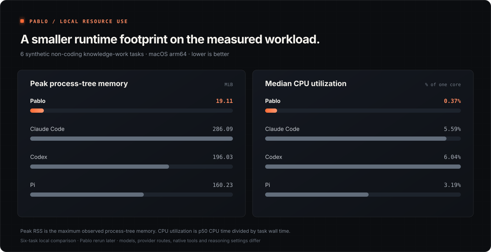

# Resource benchmark

Pablo had the lowest measured local CPU utilization and peak process-tree memory in a four-runtime view of the repository’s non-coding knowledge-work pilot. The result supports Pablo’s small-runtime goal, within the limits of this exploratory comparison.

<figure class="benchmark-figure">
  <picture>
    <source media="(max-width: 720px)" srcset="./assets/resource-usage-mobile.svg" />
    
  </picture>
  <figcaption>Lower is better. Bars use a separate linear scale from zero for each metric.</figcaption>
</figure>

## Measured values

| Runtime | Model | Peak tree memory | CPU utilization p50 | CPU time p50 |
|---|---|---:|---:|---:|
| **Pablo** | GLM Flash | **19.11 MiB** | **0.37%** | **0.083 s** |
| Claude Code | Fable 5.1 | 286.09 MiB | 5.59% | 1.710 s |
| Codex | Astra | 196.03 MiB | 6.04% | 1.186 s |
| Pi | GLM Flash | 160.23 MiB | 3.19% | 0.312 s |

Peak memory is the maximum sampled resident memory for the complete process tree across all six tasks. CPU utilization divides accumulated CPU time by task wall time and reports the result as a percentage of one core; a faster response can therefore show higher utilization even when it consumes less CPU time. The table retains median CPU seconds as a secondary value.

Relative to the nearest competitor in each chart, Pablo’s measured peak memory was 8.4 times lower than Pi’s and its median CPU utilization was 8.6 times lower than Pi’s.

## Workload and collection

The `knowledge-work-v1.1` pilot used six synthetic task families, seed 42 and one attempt per task. Tasks exercised research synthesis, incident review, policy comparison and other file-backed non-coding knowledge work. Every compared runtime completed six of six attempts, and all observations remained in the aggregates.

The monitor sampled the full process tree rather than only the launcher process. It recorded wall time, accumulated CPU seconds and peak resident memory under the same supervisor on an Apple M4 Pro host with 24 GiB RAM. The comparison used:

- Pablo `0.1.0-dev.1` with GLM Flash and provider-default reasoning.
- Claude Code `2.1.263` with Fable 5.1.
- Codex CLI `0.154.0` with Astra and medium reasoning.
- Pi `0.85.1` with GLM Flash and low reasoning.

The current Pablo result comes from a later six-task rerun. The Claude Code, Codex and Pi observations are retained byte-for-byte from the original pilot. The chart therefore describes the measured runs; it does not establish a controlled causal comparison between runtime implementations.

## Interpretation limits

Provider routes, models, reasoning settings, prompts and native tool implementations differ. Network and provider latency also affect the one-core utilization percentage. The pilot has one seed and one attempt per task, so it is useful as release evidence and a basis for a larger matched study, not as a universal efficiency ranking.

The measurements cover local CPU and RAM only. They do not measure provider infrastructure, model-serving energy, generalized answer quality or performance on software-development tasks.

## Evidence and reproduction

The repository retains the [sanitized measurement artifact](https://github.com/calebjohn24/pablo/blob/main/docs/project/evidence/c3.33c-glm-rerun-measurements.json), the [measurement report](https://github.com/calebjohn24/pablo/blob/main/docs/project/evidence/c3.33c-glm-rerun.md) and the [benchmark harness](https://github.com/calebjohn24/pablo/tree/main/scripts/knowledge-work).

Preview the benchmark matrix without making model calls:

```sh
npm run bench:knowledge
```

Live runs are explicit because they use provider credentials and incur model costs. See the harness [README](https://github.com/calebjohn24/pablo/blob/main/scripts/knowledge-work/README.md) for the current command surface, credential rules and artifact layout.
