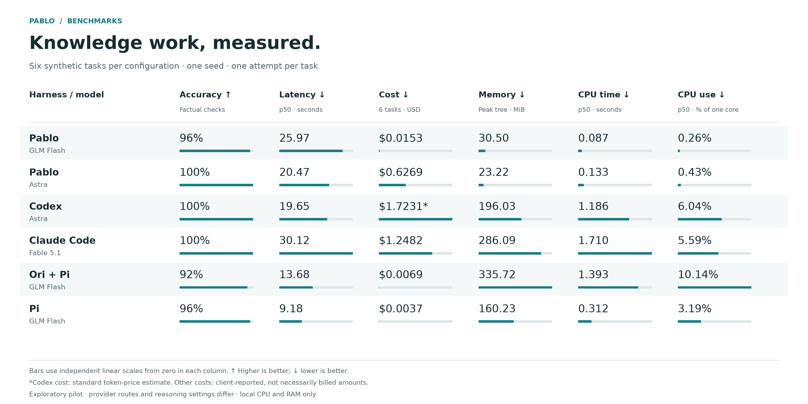

# C3.33b — Knowledge-work benchmark

Implemented the user-requested synthetic local-document comparison, including the follow-up Pablo + Astra profile. The implementation and bounded live pilot are complete. All six configurations completed six tasks. The authenticated Codex + Astra rerun uses the user-selected OpenAI API key; Ori and Pi reuse the authorized Pablo OpenRouter key.

## Corrected six-task pilot

One seed (42), one retained attempt per task/configuration, six task families, same native macOS arm64 host. All model runs were serial with builds/tests ended before measurement. This is exploratory evidence, not a statistically reliable ranking. Wall p50 is the nearest-rank quantile over completed client runs, including incorrect answers; memory is the maximum sampled simultaneous tree RSS across those tasks.

| Configuration | Factual accuracy | Wall p50 s | Peak tree MiB | CPU p50 s | CPU p50 % | Six-task cost USD |
|---|---:|---:|---:|---:|---:|---:|
| pablo | 24/25 | 25.97 | 30.50 | 0.087 | 0.26 | 0.0153 |
| pablo-astra | 25/25 | 20.47 | 23.22 | 0.133 | 0.43 | 0.6269 |
| codex | 25/25 | 19.65 | 196.03 | 1.186 | 6.04 | 1.7231 (estimate) |
| claude | 25/25 | 30.12 | 286.09 | 1.710 | 5.59 | 1.2482 |
| ori | 23/25 | 13.68 | 335.72 | 1.393 | 10.14 | 0.0069 |
| pi | 24/25 | 9.18 | 160.23 | 0.312 | 3.19 | 0.0037 |

Models: Pablo = OpenRouter `z-ai/glm-5.3-flash`; Pablo Astra = OpenRouter `openai/gpt-6-astra`; Codex = `gpt-6-astra`; Claude Code = `claude-fable-5-1`. Ori and Pi also use OpenRouter `z-ai/glm-5.3-flash`, with reasoning off. Codex uses medium effort, Claude high, Pablo provider defaults. Astra via Pablo ran in a later serial block at the user's request. Provider routing, caching, native prompts, tool implementations and reasoning settings differ; the shared Astra family is not a controlled same-provider/same-prompt experiment.

Host: Apple M4 Pro, 14 logical CPUs, 24 GiB RAM, macOS kernel 25.5.0; Node 24.11.0 and Python 3.12.13. Existing release binary SHA-256 `39669a6c4e38421a5180ad2a55278a94d95a09a440a758adfc96c3365e1126d0` was reused unchanged. No runtime build was needed for benchmark-only code.

Pablo GLM missed the incident-duration check. Direct Pi missed one policy check; Ori + Pi missed two project-plan checks. Headline accuracy counts individual factual checks (25 per configuration); strict task passes have been removed as requested. Citation-set checks remain diagnostic only. Prose quality is ungraded beyond artifact presence; the guide includes a separate blind-review rubric.

Costs total all six tasks. Pablo, Claude, Ori and Pi costs are client-reported, which may be API-equivalent estimates rather than bills. Codex's **$1.723116 is an estimate**, calculated from native token usage at [official Astra standard text prices](https://developers.openai.com/api/docs/models/gpt-6-astra): input $10/M, cached input $1/M, cache writes $12.50/M, output $50/M, verified 2026-09-12. Output already includes reasoning. No hosted-tool charges or special service tier is assumed. This is not an account invoice.

## Fixture correction and retained history

The initial v1 handoff prompt omitted the year while its answer key required 2026. Pablo + Astra preserved the missing year rather than inventing it. Review also found that the open-actions key unnecessarily required an older document whose relevant facts were already covered by newer sources. These were benchmark defects.

Version 1.1 supplies the date anchor and corrects that source set. All four functioning configurations reran the handoff, with original handoff attempts excluded from the comparison and preserved as superseded evidence. Every retained prompt, individual source file and argv for the other five tasks was checked against the current suite: 20 identical trials. The original four-configuration pilot used one byte-identical measurement supervisor; the authenticated follow-up uses the newer supervisor described below. Later controller changes add the Astra profile, fix metadata extraction from flat native trace events, distinguish completed/passed/all-attempt latency, and report interruption/authentication categories. They do not change the other five tasks, grading or native client arguments.

The initial one-task wiring pilot is retained locally under `.pablo/measurements/knowledge-work-pilot-1`, but is not mixed into the six-task comparison. It had three complete factual/citation passes and two authentication startup failures. Full raw logs, source workspaces and generated answers stay ignored locally. Checked-in [measurements](c3.33b-knowledge-measurements.json) contain sanitized per-attempt metrics, source and executable identities, exact factual/citation checks, and the superseded handoff records.

After the live pilots, timeout cleanup was hardened to kill observed descendants that create separate process groups, using process birth identity when following reparented PIDs. Its focused offline regression passed. The JSON records the exact pre-hardening measurement-supervisor hash and the newer tested supervisor separately; the retained measurements are historical observations under the recorded version, not a new performance run of the hardened supervisor. No retained task timed out or required this descendant cleanup path.

## Authenticated follow-up and limits

Installed Pi 0.85.1 and Ori 0.14.3+6e62568 into ignored local tool directories. Ori wraps Pi for this pairing. Their original six authentication failures each, and Codex's six subscription-authenticated attempts, are archived separately and excluded from the current comparison. Eighteen replacement attempts completed serially: reconciliation in `knowledge-work-authenticated-pilot`, then the remaining five tasks in `knowledge-work-authenticated-remaining`. Both used `--harnesses codex,ori,pi --reuse-pablo-openrouter --codex-api-key-file` with the user-selected private path. The source and executable identities are retained in the sanitized JSON.

The controller privately extracts only the authorized keys, passes them in the appropriate child environment, and masks captured streams across chunk boundaries. A private literal-key scan checked 128 local artifacts/specifications/reports and found zero credential matches. No credential values or private key-file paths are included in checked-in evidence.

The retained Pablo/Pablo-Astra/Claude observations use the original supervisor; replacement Codex/Ori/Pi observations use the hardened descendant cleanup and credential-redaction version. Per-run hashes preserve this instrumentation difference. No retained task timed out. The follow-up replaces whole six-task configurations without selecting attempts by score.

Resource monitoring samples the owned process group and discoverable descendants via `ps`, nominally every 100 ms plus sampling overhead, and uses POSIX `wait4` CPU accounting. RSS can double-count shared pages and miss short peaks; unjoined/detached descendants can escape complete accounting. CPU utilization is a one-core equivalent (machine-normalized values also retained). Remote inference resources are not observable. Unknown usage, cost and first-text metrics remain null; Codex completed-message receipt is not first-token latency. All failures stay in the operational denominator. See the [complete method and reproducible commands](../../../scripts/knowledge-work/README.md).

## Verification

- `node --test --test-concurrency=1 scripts/knowledge-work/benchmark.test.mjs`: 15 passed. Demonstrates seeded arithmetic, scorer negative controls, output shape/source rejection, event normalization, child memory/CPU observation, timeout group cleanup (including an observed tool with its own process group), complete runner/artifact/report handling, overwrite refusal the corrected handoff date contract, scoped credential parsing, cross-chunk redaction, cache-aware cost estimation and factual/cost aggregation.
- `node --test scripts/project.test.mjs`: 34 passed.
- `npm run typecheck`, `git diff --check`, and project consistency passed after implementation.
- `python3 scripts/verify-protocol-pins.py`: all immutable protocol identities passed; runtime/protocol code is unchanged.
- Live six-task commands: `node scripts/knowledge-work/run.mjs --live --output .pablo/measurements/knowledge-work-six-task-pilot`; `node scripts/knowledge-work/run.mjs --live --harnesses pablo-astra --output .pablo/measurements/knowledge-work-pablo-astra-pilot`.
- Corrected task: `node scripts/knowledge-work/run.mjs --live --harnesses pablo,pablo-astra,codex,claude --tasks meeting-handoff --output .pablo/measurements/knowledge-work-handoff-v1-1`.
- All live supervisors exited before later tests/measurement jobs; no performance samples overlapped another build, test or measurement job. Twenty unchanged input/argv trials verified during final evidence extraction.

## Handoff

C3.33b and the requested six-configuration pilot are complete. Increase seeds/repetitions before interpreting rankings. C3.34 packaging remains pending and held by the earlier user stop instruction. Preserve the original user stash and measurement baselines.

## Graphic readability follow-up

Replaced six repeated chart panels with one aligned comparison: a shared harness/model label, larger numeric values, alternating row shading and compact bars with independent zero-based column scales. All six requested metrics and the cost-estimate note remain visible. Rendered PNG/SVG were visually inspected for legibility and clipping; the measurement JSON is byte-identical to the prior committed results. No provider runs or scoring changes were needed.
